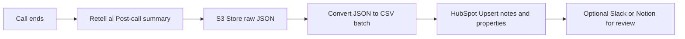

# Post‑Call Analysis Sync (Retell.ai → S3 → HubSpot)
n8n workflows to capture **post‑call summaries** (via Retell.ai), store them in **S3**, convert **JSON → CSV**, and sync structured insights back to **HubSpot** (for social content & follow‑ups).

## Flow (Mermaid)

## Highlights
- **Event‑driven**: post‑call summaries land in S3 immediately
- **Transform**: JSON → CSV for analytics / bulk ops
- **CRM sync**: HubSpot notes + properties for searchability
- **Sanitized**: keys, tokens, buckets, URLs → placeholders

## Placeholders
- `{{hubspotToken}}`, `{{awsAccessKeyId}}`, `{{awsSecretAccessKey}}`, `{{awsRegion}}`
- `{{s3Bucket}}`, `{{s3Key}}`, `{{externalUrl}}`
- `{{redactedEmail}}`, `{{redactedPhone}}`

📜 License: CC BY‑NC 4.0 — Portfolio/demo only.
